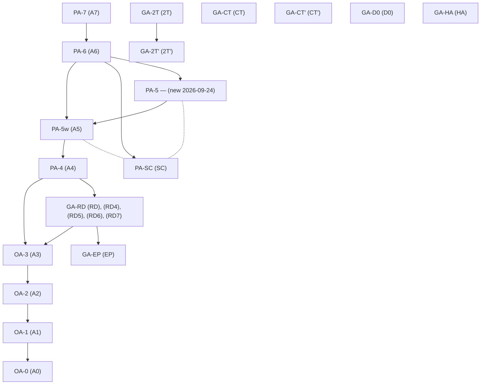

<!-- GENERATED by tools/kb.py build — do not edit -->
# Assumptions

Generated by `py tools/kb.py build` from the `implies`, `incomparable_with` and `old` fields of `assumptions/*.md`. An arrow X → Y means X implies Y; a dotted edge joins two incomparable assumptions.

## Hierarchy

- **OA** — Origami (conditions on σ, τ)
  - [OA-0](OA-0.md) (A0) — No assumption beyond $G=\langle\sigma,\tau\rangle$ transitive on the $n$ squares.
  - [OA-1](OA-1.md) (A1) — There is $\iota\in S_n$ with $\iota\sigma\iota^{-1}=\sigma^{-1}$, $\iota\tau\iota^{-1}=\tau^{-1}$ · implies OA-0
  - [OA-2](OA-2.md) (A2) — OA-1 with some such $\iota$ satisfying $\iota^2=1$, i.e · implies OA-1
  - [OA-3](OA-3.md) (A3) — An injective $\phi:K_4\hookrightarrow S_n$ with $\phi(a,b)\sigma\phi(a,b)^{-1}=\sigma^a$ and $\phi(a,b)\tau\phi(a,b)^{-1}=\tau^b$, acting **freely** · implies OA-2
- **PA** — Parking garage (geometric)
  - [PA-4](PA-4.md) (A4) — $M$ is the unfolding of a rectangle-tiled parking garage $P$ · implies OA-3, GA-RD
  - [PA-5](PA-5.md) — (new 2026-09-24) — PA-4, and every semi-corner of P lifts to relative marking points of M (regular marked points); by GEO-9 this holds iff every semi-corner has angle π, i.e. every corner is an odd multiple of π/2 · implies PA-5w · incomparable with PA-SC
  - [PA-5w](PA-5w.md) (A5) — PA-4, and no corner of $P$ has angle $2\pi,4\pi,6\pi,\dots$; slit tips are excluded · implies PA-4 · incomparable with PA-SC
  - [PA-6](PA-6.md) (A6) — $M$ is the unfolding of a **simple** rectangle-tiled polygon embedded in the plane, i.e · implies PA-5w, PA-SC, PA-5
  - [PA-7](PA-7.md) (A7) — $P$ is a $p\times q$ rectangle · implies PA-6
  - [PA-SC](PA-SC.md) (SC) — $P$ is simply connected · incomparable with PA-5w, PA-5
- **GA** — Group-theoretic tags
  - [GA-2T](GA-2T.md) (2T) — Each nonempty difference class $D_\delta$ is one $G$-orbital. · implies GA-2T′
  - [GA-2T′](GA-2T′.md) (2T′) — Relative 2-transitivity with respect to $A$ **and** the centraliser $Z$.
  - [GA-CT](GA-CT.md) (CT) — Every nontrivial centralising $T$ has a $T$-invariant Christoffel orbit of the right parity.
  - [GA-CT′](GA-CT′.md) (CT′) — The necessary condition matching GA-2T′
  - [GA-D0](GA-D0.md) (D0) — $R^{\mathrm{pow}}$ meets the zero difference class.
  - [GA-EP](GA-EP.md) (EP) — $\Lambda\subseteq2\mathbb Z^2$, where $\Lambda$ is the absolute period lattice (DEF-1).
  - [GA-HA](GA-HA.md) (HA) — The block group $H$ contains $A_m$.
  - [GA-RD](GA-RD.md) (RD), (RD4), (RD5), (RD6), (RD7) — $(\sigma,\tau)$ is the twisted diagonal of a reflection datum (DEF-2) · implies OA-3, GA-EP

## Implication chart

