<!-- GENERATED FILE -- do not edit by hand. Regenerate with `py scripts/check_paper.py`. -->

# Statement registry

Generated by `scripts/check_paper.py` on 2026-09-27. Every edit here is overwritten on the next run.

153 statements: 18 conjectural, 62 established, 2 meta, 71 sketch.

Rule check: 2 violations, 125 warnings.

## Introduction

| label | env | title | colour | proof | uses | used by | cites | Claude notes |
|---|---|---|---|---|---|---|---|---|
| `defn:resolvable` | defn |  | established | cited | `defn:unfolding` | `rmk:slope-values` | `LMW16` |  |
| `thm:main-resolvable-4k` | thm |  | conjectural | none |  |  |  |  |
| `thm:main-parking-garage` | thm |  | conjectural | none |  | `defn:billiard-pathologies` |  |  |
| `conj:origami-slope` | conj |  | conjectural | none |  |  |  |  |
| `conj:slope-one-quotient` | conj |  | conjectural | none |  |  |  |  |
| `thm:arithmetic-billiard-goal` | thm | Arithmetic billiards | conjectural | none |  |  |  |  |
| `thm:orthogonal-billiard-goal` | thm | Orthogonal billiards | conjectural | none |  |  |  |  |
| `defn:blocking` | defn |  | established | none |  |  |  |  |

## Flat Structures and Flat Morphisms

| label | env | title | colour | proof | uses | used by | cites | Claude notes |
|---|---|---|---|---|---|---|---|---|
| `defn:flat-structure` | defn | Flat structure | established | none | `defn:corners` | `defn:billiard-pathologies`, `defn:unfolding`, `fact:flat-structure-charts`, `lem:flat-equivalence-props`, `lem:lift-to-unfoldings`, `lem:similarity-forced-by-rotation` |  |  |
| `fact:flat-structure-invariants` | fact | A flat structure is determined by its presentation | established | yes |  | `lem:flat-equivalence-props` |  |  |
| `fact:flat-structure-charts` | fact | Charts of a flat structure | established | yes | `defn:flat-structure` | `defn:flat-equivalence`, `defn:flat-morphism`, `defn:unfolding`, `fact:flat-morphism-compose`, `lem:lift-to-unfoldings`, `rmk:flat-morphism-flow`, `rmk:flat-structure-orbifold`, `rmk:plug-unfolding`, +1 more |  |  |
| `defn:unfolding` | defn | Unfolding | established | none | `defn:flat-structure`, `fact:flat-structure-charts`, `defn:flat-morphism` | `defn:resolvable`, `lem:lift-to-unfoldings`, `rmk:plug-unfolding` |  |  |
| `rmk:flat-structure-orbifold` | rmk | Flat structures as orbifolds | sketch | cited | `fact:flat-structure-charts` |  | `Go22`, `Th80 (Ch.\ 13)`, `Th97` |  |
| `defn:flat-morphism` | defn | Flat morphisms | established | none | `fact:flat-structure-charts`, `defn:flat-equivalence` | `cor:relative-marking-invariance-preimage`, `defn:unfolding`, `fact:compatible`, `lem:flat-equivalence-props`, `lem:lift-to-unfoldings`, `lem:relative-marking-invariance`, `prop:delaunay-invariance`, `rmk:cornered-arithmetic-ds`, +3 more |  |  |
| `defn:flat-equivalence` | defn | Translation equivalence and flat equivalence | established | none | `fact:flat-structure-charts` | `defn:flat-morphism`, `lem:flat-equivalence-props`, `lem:lift-to-unfoldings`, `lem:similarity-forced-by-rotation`, `rmk:polygon-determined` |  |  |
| `lem:similarity-forced-by-rotation` | lem | A rotation forces a similarity | sketch | sketched | `defn:flat-structure`, `defn:flat-equivalence` |  |  |  |
| `lem:lift-to-unfoldings` | lem | Lifting to the unfoldings | sketch | sketched | `defn:unfolding`, `defn:flat-morphism`, `defn:flat-equivalence`, `defn:flat-structure`, `fact:flat-structure-charts` | `lem:flat-equivalence-props`, `lem:structure-group-hierarchy`, `prop:unfolding-lift-general`, `rmk:flat-morphism-flow` | `Ha02 (\S 1.3)` |  |
| `lem:structure-group-hierarchy` | lem | Hierarchy of structure groups | sketch | sketched | `lem:lift-to-unfoldings` | `fact:flat-morphism-compose` |  |  |
| `fact:flat-morphism-compose` | fact | The category of flat structures | sketch | sketched | `fact:flat-structure-charts`, `lem:structure-group-hierarchy` |  |  |  |
| `lem:flat-equivalence-props` | lem | What the two notions mean | sketch | sketched | `defn:flat-equivalence`, `defn:flat-morphism`, `defn:flat-structure`, `ex:two-square-tori`, `lem:lift-to-unfoldings`, `fact:flat-structure-invariants` |  |  | yes |
| `ex:two-square-tori` | ex | Two flat structures on one metric space | established | none |  | `lem:flat-equivalence-props` |  |  |
| `rmk:polygon-determined` | rmk | A billiard table is determined by its flat structure | sketch | sketched | `defn:billiard-pathologies`, `defn:flat-equivalence`, `fact:flat-structure-charts` |  | `MT02 (\S 1.5)`, `McM23 (Appendix~A)`, `ZK75 (\S 1, Prop.~1)` | yes |
| `rmk:flat-morphism-flow` | rmk | Flat morphisms and the straight-line flow | sketch | sketched | `defn:flat-morphism`, `lem:lift-to-unfoldings`, `fact:flat-structure-charts` |  |  |  |
| `defn:double-cover` | defn |  | established | none |  |  |  |  |
| `ex:platonic-boundary` | ex | Boundaries of solid bodies | established | cited |  |  | `AAH22`, `AAH22 (Proposition 2.4)`, `AAH22 (Table 1)`, `AAH22 (\S 2.1)` |  |
| `defn:billiard-table` | defn | Billiard table | sketch | none | `defn:billiard-pathologies` | `rmk:billiard-corners` |  |  |
| `prop:polygon-sym` | prop |  | sketch | sketched |  |  |  |  |
| `defn:billiard-pathologies` | defn |  | sketch (partly sketch) | cited | `defn:flat-structure`, `rmk:plug-unfolding`, `prop:pathologies-inherited`, `thm:main-parking-garage` | `cor:parking-garage-classification`, `defn:billiard-table`, `rmk:billiard-corners`, `rmk:polygon-determined` | `CW12`, `McM23 (Appendix A)` | yes |
| `rmk:plug-unfolding` | rmk | Interior cone points and semi-corners unfold to several cone points | established | none | `fact:flat-structure-charts`, `defn:unfolding` | `defn:billiard-pathologies`, `rmk:billiard-corners` |  |  |
| `prop:pathologies-inherited` | prop |  | sketch | none |  | `defn:billiard-pathologies` |  |  |
| `prop:vorobets-lift` | prop | {\cite[Proposition 5.1]{Vo96a}} | established | none |  |  |  |  |
| `prop:unfolding-lift-general` | prop |  | sketch | sketched | `lem:lift-to-unfoldings` |  |  |  |
| `ex:rhombus-same-unfolding` | ex |  | sketch | none |  | `rmk:best-converse` |  |  |

## Induced Markings and Periodic Points

| label | env | title | colour | proof | uses | used by | cites | Claude notes |
|---|---|---|---|---|---|---|---|---|
| `defn:compatible` | defn |  | established | none |  | `fact:compatible`, `lem:marking-full-preimage`, `lem:null-holonomy-tori`, `lem:periodic-coimage`, `prop:reduced-torus-compatible`, `quest:half-translation-periodic` |  |  |
| `fact:compatible` | fact |  | established | yes | `defn:compatible`, `defn:flat-morphism` |  |  |  |
| `rmk:orbifold-vs-marked` | rmk |  | meta | none | `defn:saturated-marking` |  |  |  |
| `defn:periodic-points` | defn |  | established (partly meta) | none |  | `defn:saturated-marking`, `lem:periodic-inheritence`, `quest:half-translation-periodic`, `rmk:apisa-wright-reduction` |  |  |
| `quest:half-translation-periodic` | quest | Half-translation surfaces | established | none | `defn:periodic-points`, `defn:compatible`, `cor:periodic-prim-relations`, `defn:entangled` |  |  |  |
| `thm:aw-finiteness` | thm |  | established | none |  |  |  |  |
| `rmk:nonempty-marking` | rmk |  | established | none |  | `lem:covering-moduli-proper`, `lem:marking-full-preimage`, `lem:periodic-inheritence`, `lem:relative-marking-invariance`, `lem:thick-part-compact`, `prop:cornered-arithmetic`, `rmk:full-preimage-free`, `thm:torus-periodic-points` |  |  |
| `defn:forgetful-map` | defn | Forgetful maps | sketch | none |  | `fact:forgetful-props`, `lem:marking-full-preimage` |  |  |
| `fact:forgetful-props` | fact |  | sketch | sketched | `defn:forgetful-map` | `lem:marking-full-preimage`, `lem:periodic-coimage`, `lem:periodic-inheritence`, `thm:torus-periodic-points` | `AW21`, `AW21 (Lemma~2.1)`, `EMM15 (Theorem~2.1)`, `LMW16`, `LMW16 (Lemma~6 and \S 2.3)`, `LMW16 (Lemma~6)`, +3 more |  |
| `lem:periodic-inheritence` | lem |  | sketch | sketched | `defn:periodic-points`, `fact:forgetful-props`, `rmk:nonempty-marking` | `lem:marking-full-preimage`, `prop:periodicity-invariance` |  |  |
| `defn:covering-moduli` | defn | Moduli spaces of marked structures and of coverings | sketch | cited |  | `lem:covering-moduli-proper`, `lem:marking-full-preimage`, `lem:periodic-coimage`, `lem:thick-part-compact`, `prop:periodicity-invariance` | `SW08 (Propositions 6--7 and Corollary 17)` |  |
| `lem:covering-moduli-proper` | lem | The covering moduli maps are closed and finite-to-one | sketch | sketched | `defn:covering-moduli`, `rmk:nonempty-marking`, `defn:systole`, `lem:thick-part-compact` | `lem:marking-full-preimage`, `prop:periodicity-invariance` | `EMM15`, `EMM15 (Theorem~2.1)`, `KMS86 (Proposition~1)`, `Kle10 (Theorem~1.1)`, `MT02 (Proposition~3.6)`, `SW08 (Corollary 17)`, +2 more | yes |
| `lem:marking-full-preimage` | lem | Marking the full preimage is free | sketch | sketched | `defn:compatible`, `defn:covering-moduli`, `rmk:nonempty-marking`, `prop:relative-marking-compatible`, `lem:covering-moduli-proper`, `defn:forgetful-map`, `fact:forgetful-props`, `lem:periodic-inheritence` | `lem:periodic-coimage`, `rmk:full-preimage-free` |  |  |
| `lem:periodic-coimage` | lem |  | sketch | sketched | `defn:compatible`, `lem:marking-full-preimage`, `defn:covering-moduli`, `fact:forgetful-props` | `prop:periodicity-invariance` |  |  |
| `prop:periodicity-invariance` | prop | Periodic invariance | sketch | sketched | `lem:periodic-coimage`, `lem:periodic-inheritence`, `defn:covering-moduli`, `lem:covering-moduli-proper` | `quest:periodic-fibre-size`, `rmk:full-preimage-free` |  | yes |
| `rmk:full-preimage-free` | rmk | The full-preimage hypothesis is free | sketch | none | `prop:periodicity-invariance`, `defn:flat-morphism`, `lem:marking-full-preimage`, `rmk:nonempty-marking` |  |  |  |
| `quest:periodic-fibre-size` | quest |  | established | none | `prop:periodicity-invariance` |  |  |  |
| `quest:primitive-base` | quest |  | established | none |  |  |  |  |
| `rmk:aw-marked-periodic` | rmk |  | sketch | cited |  |  | `AW21 (Theorem~1.3)`, `AW21 (\S 1)` |  |
| `thm:torus-periodic-points` | thm | Periodic points in tori | sketch | sketched | `rmk:nonempty-marking`, `fact:forgetful-props` | `rmk:slope-values-torus` | `EMM15 (Theorem~2.1)`, `LMW16 (\S 2.2)`, `Wr14` | yes |
| `ex:periodicity-coex` | ex |  | established | none |  |  |  |  |
| `cor:periodic-prim-relations` | cor | Classification of periodic points | established | none |  | `quest:half-translation-periodic` |  |  |
| `defn:relative-marking` | defn | Relative marking | established | none |  | `cor:arith-relative-position`, `cor:relative-marking-invariance-preimage`, `lem:null-holonomy-tori`, `lem:relative-marking-invariance`, `lem:torus-corners-torsion`, `prop:cornered-arithmetic`, `prop:relative-marking-compatible` |  |  |
| `prop:relative-marking-compatible` | prop |  | established | yes | `defn:relative-marking` | `cor:relative-marking-invariance-preimage`, `lem:marking-full-preimage`, `lem:relative-marking-invariance`, `prop:reduced-torus-compatible` |  |  |
| `lem:relative-marking-invariance` | lem | Full invariance of the relative marking | sketch | sketched | `prop:relative-marking-compatible`, `rmk:nonempty-marking`, `defn:flat-morphism`, `defn:relative-marking` | `lem:torus-corners-torsion` |  |  |
| `cor:relative-marking-invariance-preimage` | cor | The full-preimage case | established | yes | `defn:flat-morphism`, `prop:relative-marking-compatible`, `defn:relative-marking` |  |  |  |
| `defn:corners` | defn | Corners | established | none |  | `defn:flat-structure`, `ex:branched-double-cover`, `lem:torus-corners-torsion`, `prop:cornered-arithmetic`, `prop:corners-finite` |  |  |
| `rmk:billiard-corners` | rmk | Corners of a billiard table | sketch | none | `defn:billiard-pathologies`, `rmk:plug-unfolding`, `defn:billiard-table` |  |  |  |
| `lem:trans-auth-effect` | lem |  | established | yes |  | `rmk:corners-vs-periodic` |  |  |
| `prop:corners-finite` | prop |  | established | yes | `defn:corners` |  |  |  |
| `rmk:corners-vs-periodic` | rmk |  | established (partly sketch) | cited | `lem:trans-auth-effect` | `quest:billiard-noncorner-periodic` | `EMMW20 (\S 6)`, `Mo06` | yes |
| `quest:billiard-noncorner-periodic` | quest |  | established | none | `rmk:corners-vs-periodic` |  |  |  |
| `lem:torus-corners-torsion` | lem | Cornered tori are marked once | sketch | sketched | `defn:corners`, `defn:relative-marking`, `lem:relative-marking-invariance` | `ex:branched-double-cover`, `ex:torus-corners`, `prop:cornered-arithmetic`, `rmk:cornered-arithmetic-ds` |  |  |
| `ex:torus-corners` | ex | Corners of marked tori | sketch | none | `lem:torus-corners-torsion` |  |  |  |
| `(unlabelled)` | prop |  | established | none |  |  |  |  |
| `defn:entangled` | defn |  | conjectural | none |  | `quest:half-translation-periodic` |  |  |

## Slopes and Blocking Configurations

| label | env | title | colour | proof | uses | used by | cites | Claude notes |
|---|---|---|---|---|---|---|---|---|
| `defn:saturated-marking` | defn |  | established (partly sketch) | cited | `defn:periodic-points` | `prop:saturated-markings-coverings`, `rmk:orbifold-vs-marked`, `rmk:saturation-vs-symmetry` | `AW21 (Lemma 2.13)`, `AW21 (\S 1)`, `AW21 (discussion preceding Definition 2.3)` | yes |
| `rmk:saturation-vs-symmetry` | rmk | Saturation and the relation $\sim$ | sketch | cited | `defn:saturated-marking`, `fact:aw-closed-markings` |  | `AW21` |  |
| `defn:slope` | defn | Slope of a two-point marking | sketch | none |  | `rmk:slope-values-torus` |  |  |
| `rmk:slope-values` | rmk |  | established | cited | `fact:aw-closed-markings`, `lem:involution-blocking`, `cor:slope-minus-one`, `defn:resolvable`, `rmk:slope-values-resolvable`, `rmk:slope-values-torus`, `thm:arith-slope-constraint` |  | `LMW16 (\S 6.4)` |  |
| `fact:aw-slope-pm-one` | fact | {\cite[Theorem~2.8]{AW21}} | established | none |  | `cor:slope-minus-one`, `prop:saturated-markings-coverings`, `rmk:slope-values-resolvable` |  |  |
| `rmk:slope-values-resolvable` | rmk | Slopes in the resolvable case | established | cited | `fact:aw-slope-pm-one`, `cor:slope-minus-one` | `rmk:slope-values` | `AW21 (Definition~2.3)`, `AW21 (Theorem~1.2)` |  |
| `rmk:slope-values-torus` | rmk | Slopes on torus covers | sketch | cited | `defn:slope`, `thm:torus-periodic-points` | `rmk:slope-values` | `LMW16 (Theorem~1)`, `LMW16 (\S 6, Examples 1--2)` |  |
| `ex:translation-orbit-marking` | ex |  | sketch | none |  |  |  |  |
| `fact:aw-closed-markings` | fact | {\cite[Lemma~2.10]{AW21}} | established | none |  | `rmk:saturation-vs-symmetry`, `rmk:slope-values` |  |  |
| `prop:saturated-markings-coverings` | prop | Saturated markings and coverings | sketch | sketched | `defn:saturated-marking`, `fact:aw-slope-pm-one` |  | `AW21 (Lemma~2.10)`, `AW21 (Sublemma~2.12)` |  |
| `defn:cylinder-monodromy` | defn |  | established | none |  |  |  |  |
| `fact:S-normal-symmetric` | fact |  | sketch | none |  |  |  |  |
| `prop:blocking-monodromy` | prop |  | sketch | none |  |  |  |  |
| `defn:primitive-holonomy` | defn | Primitive holonomy vectors | sketch | none |  |  |  |  |
| `lem:primitive-coset-existence` | lem | Existence of primitive vectors in cosets | sketch | sketched |  | `prop:fiber-disjoint-trajectory` |  |  |
| `lem:primitive-purity` | lem | Purity and absence of sub-periods | sketch | sketched |  | `prop:fiber-disjoint-trajectory` |  |  |
| `prop:fiber-disjoint-trajectory` | prop | Existence of fibre-disjoint straight trajectories | sketch | sketched | `lem:primitive-coset-existence`, `lem:primitive-purity` | `cor:slope-minus-one` |  |  |
| `rmk:apisa-wright-reduction` | rmk | Apisa--Wright minimal blocking reduction | sketch | cited | `thm:moeller-primitive`, `defn:periodic-points` | `cor:slope-minus-one` | `AW21 (Theorem~3.16(1))`, `AW21 (\S 3)` |  |
| `cor:slope-minus-one` | cor | Obstruction to relative deformation slope $\lambda = 1$ | sketch | sketched | `rmk:apisa-wright-reduction`, `prop:fiber-disjoint-trajectory`, `fact:aw-slope-pm-one` | `rmk:slope-values`, `rmk:slope-values-resolvable` | `AW21 (Theorem~1.2)` |  |

## Blocking in Arithmetic Surfaces

| label | env | title | colour | proof | uses | used by | cites | Claude notes |
|---|---|---|---|---|---|---|---|---|
| `prop:tc-class` | prop | {\cite[Proposition 3.11]{AW21}} | established | none |  | `quest:finite-blocking-Bn-small` |  |  |
| `defn:arithmetic` | defn |  | established | none |  | `prop:cornered-arithmetic` |  |  |
| `prop:cornered-arithmetic` | prop | Cornered implies arithmetic | sketch | sketched | `rmk:nonempty-marking`, `defn:relative-marking`, `lem:torus-corners-torsion`, `defn:corners`, `defn:arithmetic` | `ex:branched-double-cover`, `rmk:cornered-arithmetic-ds` |  |  |
| `rmk:cornered-arithmetic-ds` | rmk | The same mechanism for DS systems | sketch | none | `prop:cornered-arithmetic`, `lem:torus-corners-torsion`, `ex:bary-delaunay`, `thm:barycentric-ds-bijection`, `thm:polygonal-ds-bijection`, `defn:flat-morphism` |  |  |  |
| `ex:branched-double-cover` | ex | A branched double cover | sketch | none | `defn:corners`, `prop:cornered-arithmetic`, `lem:torus-corners-torsion` |  |  |  |
| `cor:arithmetic-k-diff` | cor | Arithmetic $k$-differentials | sketch | none |  |  |  |  |
| `cor:parking-garage-classification` | cor |  | sketch | none | `defn:billiard-pathologies` |  |  |  |
| `conj:arith-relative-marking` | conj |  | conjectural | none |  |  |  |  |
| `cor:arith-slope-pm-one` | cor | Slopes of non-illumination | conjectural | none |  |  |  |  |
| `cor:arith-relative-position` | cor | Relative position of non-illuminable pairs | conjectural | none | `defn:relative-marking` |  |  |  |
| `thm:arith-slope-constraint` | conj |  | conjectural | none |  | `rmk:slope-values` |  |  |
| `cor:arith-billiard-finite` | cor | Finite non-illumination in arithmetic billiards | conjectural | none |  |  |  |  |
| `cor:arith-k-diff-finite` | cor |  | conjectural | none |  |  |  |  |
| `quest:arith-k-diff-rectangle-tiled` | quest |  | conjectural | none |  |  |  |  |
| `(unlabelled)` | quest |  | conjectural | none |  |  |  |  |
| `lem:illumination-chase` | lem | Illumination chase | established | sketched |  |  |  |  |
| `lem:tokarsky-target` | lem |  | conjectural | cited |  |  | `HST08` |  |
| `conj:torus-cover-tokarsky` | conj |  | conjectural | none |  | `quest:finite-blocking-Bn-small` |  |  |
| `quest:finite-blocking-Bn-small` | quest |  | established | sketched | `conj:torus-cover-tokarsky`, `prop:tc-class` |  |  |  |

## Transfer to Billiards and $k$-Differentials

| label | env | title | colour | proof | uses | used by | cites | Claude notes |
|---|---|---|---|---|---|---|---|---|
| `conj:unfolding-characterization` | conj |  | conjectural | none |  |  |  |  |
| `prop:prim-polygon` | prop |  | sketch (partly sketch) | sketched | `thm:primitive-construction` |  |  |  |
| `rmk:best-converse` | rmk |  | established | none | `ex:rhombus-same-unfolding` |  |  |  |

## Delaunay--Schreier Graphs and the Primitive Surface

| label | env | title | colour | proof | uses | used by | cites | Claude notes |
|---|---|---|---|---|---|---|---|---|
| `defn:lts` | defn | Labelled transition system \cite{Va10, Ba22} | established | none |  |  |  |  |
| `defn:lts-properties` | defn | Properties of an LTS | established | none |  |  |  |  |
| `defn:bisimulation` | defn | Bisimulation | established | none |  |  |  |  |
| `defn:zigzag` | defn | Zig-zag morphism | established | none |  |  |  |  |
| `defn:schreier-graph` | defn | Schreier graph | established | none |  |  |  |  |
| `thm:schreier-lts-bijection` | thm |  | sketch | none |  |  |  |  |
| `defn:equivariant-covering` | defn | Equivariant covering | established | none |  |  |  |  |
| `fact:equivariant-is-zigzag` | fact |  | sketch | none |  |  |  |  |
| `fact:polygonal-ds-properties` | fact |  | sketch | none |  |  |  |  |
| `ex:ppsg` | ex | Polygonal DS graph | established | none | `defn:delaunay` |  |  |  |
| `thm:polygonal-ds-bijection` | thm |  | sketch | none |  | `rmk:cornered-arithmetic-ds` |  |  |
| `fact:barycentric-ds-properties` | fact |  | sketch | none |  |  |  |  |
| `ex:bary-delaunay` | ex | Barycentric DS graph | established | cited |  | `rmk:cornered-arithmetic-ds` | `Ha02 (\S 2.1)` |  |
| `thm:barycentric-ds-bijection` | thm |  | sketch | none | `defn:flat-morphism` | `rmk:cornered-arithmetic-ds` |  |  |
| `thm:moeller-primitive` | thm | {\cite[Theorem 2.6]{Mo06}} | established | none |  | `rmk:apisa-wright-reduction` |  |  |
| `thm:primitive-construction` | thm |  | sketch | sketched |  | `prop:prim-polygon` |  |  |
| `thm:primitive-G-structure` | thm |  | sketch | sketched |  |  |  |  |
| `ex:tori-classification` | ex |  | meta | none |  |  |  |  |

## Background and Cited Results

| label | env | title | colour | proof | uses | used by | cites | Claude notes |
|---|---|---|---|---|---|---|---|---|
| `lem:tok` | lem | {\cite[Lemma 4.1]{To95}} | established | none |  |  |  |  |
| `lem:involution-blocking` | lem |  | sketch | none |  | `rmk:slope-values` |  |  |
| `cor:tokarsky-corners` | cor |  | sketch | none |  |  |  |  |
| `lem:tokarsky-descends` | lem |  | sketch | none |  |  |  |  |
| `prop:vorobets-veech-inclusion` | prop | {\cite[Proposition 5.6]{Vo96a}} | established | none |  |  |  |  |

## Metric decompositions and the systole-thick part

| label | env | title | colour | proof | uses | used by | cites | Claude notes |
|---|---|---|---|---|---|---|---|---|
| `fact:positive-systole` | fact |  | established | none |  |  |  |  |
| `lem:saddle-homotopy` | lem |  | established | yes |  | `cor:short-path-geodesic`, `lem:thick-part-compact` |  |  |
| `cor:short-path-geodesic` | cor |  | established | yes | `lem:saddle-homotopy` | `lem:straightline-invariance` |  |  |
| `lem:straightline-invariance` | lem |  | established | yes | `cor:short-path-geodesic` | `prop:Voronoi-invariance` |  |  |
| `prop:Voronoi-invariance` | prop |  | established | yes | `lem:straightline-invariance` |  |  |  |
| `cor:voronoi-permutation` | cor |  | sketch | none |  |  |  |  |
| `defn:delaunay` | defn |  | sketch | cited |  | `ex:ppsg`, `lem:thick-part-compact`, `prop:delaunay-invariance` | `MS91 (\S4)` |  |
| `prop:delaunay-isometry-permutation` | prop |  | established | yes |  |  |  |  |
| `cor:db-faith` | cor |  | sketch | none |  |  |  |  |
| `prop:delaunay-invariance` | prop |  | sketch | yes | `defn:delaunay`, `defn:flat-morphism` |  |  | yes |
| `defn:systole` | defn | Saddle connections and the systole of a marked surface | established | none |  | `lem:covering-moduli-proper` |  |  |
| `lem:thick-part-compact` | lem | Thick parts of the marked moduli spaces are compact | sketch | sketched | `defn:covering-moduli`, `rmk:nonempty-marking`, `defn:delaunay`, `lem:saddle-homotopy` | `lem:covering-moduli-proper` | `MT02 (Definition~1.5)`, `MT02 (Lemma~1.6)`, `SW08` | yes |

## Null-holonomy: a failed attempt

| label | env | title | colour | proof | uses | used by | cites | Claude notes |
|---|---|---|---|---|---|---|---|---|
| `defn:null-holonomy` | defn |  | established | none |  |  |  |  |
| `defn:maximal-torus` | defn | The maximal and the reduced torus | sketch | none |  | `lem:null-holonomy-tori` |  |  |
| `lem:null-holonomy-tori` | lem | $Z(X)$ as a full preimage | sketch | sketched | `defn:compatible`, `defn:relative-marking`, `defn:maximal-torus` | `ex:reduced-torus-16`, `prop:reduced-torus-balanced` |  |  |
| `prop:reduced-torus-covering` | prop | The reduced torus under a translation in charts | sketch | sketched |  | `ex:reduced-torus-32`, `prop:reduced-torus-balanced`, `prop:reduced-torus-compatible` |  |  |
| `prop:reduced-torus-compatible` | prop | Compatible coverings preserve the reduced torus | sketch | sketched | `prop:reduced-torus-covering`, `defn:compatible`, `prop:relative-marking-compatible` | `prop:reduced-torus-balanced` |  |  |
| `prop:reduced-torus-balanced` | prop | Coverings of a surface with $Z(X) = \Sigma_X$ | sketch | sketched | `prop:reduced-torus-covering`, `lem:null-holonomy-tori`, `prop:reduced-torus-compatible` | `ex:reduced-torus-16` |  |  |
| `ex:reduced-torus-32` | ex | A covering that shrinks the reduced torus | sketch | none | `prop:reduced-torus-covering` | `ex:reduced-torus-16` |  |  |
| `ex:reduced-torus-16` | ex | $Z(X) = \Sigma_X$ does not preserve the reduced torus | sketch | none | `ex:reduced-torus-32`, `lem:null-holonomy-tori`, `prop:reduced-torus-balanced` |  |  |  |

## Blocking the main theorem

For each `thm:` of the introduction (and `thm:main-resolvable-4k` in particular), the transitive set of `sketch`/`conjectural` statements it rests on.

- **`thm:main-resolvable-4k`** (conjectural, sections/introduction.tex:37) -- 0 blocking statements
  - _nothing is cross-referenced from this statement._

- **`thm:main-parking-garage`** (conjectural, sections/introduction.tex:44) -- 0 blocking statements
  - _nothing is cross-referenced from this statement._

- **`thm:arithmetic-billiard-goal`** (conjectural, sections/introduction.tex:84) -- 0 blocking statements
  - _nothing is cross-referenced from this statement._

- **`thm:orthogonal-billiard-goal`** (conjectural, sections/introduction.tex:94) -- 0 blocking statements
  - _nothing is cross-referenced from this statement._

## Sketches with nothing depending on them

- `rmk:flat-structure-orbifold` (rmk, sections/flat_structures.tex:198) -- Flat Structures and Flat Morphisms
- `lem:similarity-forced-by-rotation` (lem, sections/flat_structures.tex:335) -- Flat Structures and Flat Morphisms
- `fact:flat-morphism-compose` (fact, sections/flat_structures.tex:697) -- Flat Structures and Flat Morphisms
- `lem:flat-equivalence-props` (lem, sections/flat_structures.tex:740) -- Flat Structures and Flat Morphisms
- `rmk:polygon-determined` (rmk, sections/flat_structures.tex:857) -- Flat Structures and Flat Morphisms
- `rmk:flat-morphism-flow` (rmk, sections/flat_structures.tex:983) -- Flat Structures and Flat Morphisms
- `prop:polygon-sym` (prop, sections/flat_structures.tex:1145) -- Flat Structures and Flat Morphisms
- `prop:unfolding-lift-general` (prop, sections/flat_structures.tex:1265) -- Flat Structures and Flat Morphisms
- `rmk:full-preimage-free` (rmk, sections/markings.tex:368) -- Induced Markings and Periodic Points
- `rmk:aw-marked-periodic` (rmk, sections/markings.tex:387) -- Induced Markings and Periodic Points
- `rmk:billiard-corners` (rmk, sections/markings.tex:690) -- Induced Markings and Periodic Points
- `ex:torus-corners` (ex, sections/markings.tex:832) -- Induced Markings and Periodic Points
- `rmk:saturation-vs-symmetry` (rmk, sections/slope_blocking.tex:69) -- Slopes and Blocking Configurations
- `ex:translation-orbit-marking` (ex, sections/slope_blocking.tex:243) -- Slopes and Blocking Configurations
- `prop:saturated-markings-coverings` (prop, sections/slope_blocking.tex:267) -- Slopes and Blocking Configurations
- `fact:S-normal-symmetric` (fact, sections/slope_blocking.tex:346) -- Slopes and Blocking Configurations
- `prop:blocking-monodromy` (prop, sections/slope_blocking.tex:353) -- Slopes and Blocking Configurations
- `defn:primitive-holonomy` (defn, sections/slope_blocking.tex:369) -- Slopes and Blocking Configurations
- `rmk:cornered-arithmetic-ds` (rmk, sections/arithmetic.tex:96) -- Blocking in Arithmetic Surfaces
- `ex:branched-double-cover` (ex, sections/arithmetic.tex:136) -- Blocking in Arithmetic Surfaces
- `cor:arithmetic-k-diff` (cor, sections/arithmetic.tex:204) -- Blocking in Arithmetic Surfaces
- `cor:parking-garage-classification` (cor, sections/arithmetic.tex:213) -- Blocking in Arithmetic Surfaces
- `prop:prim-polygon` (prop, sections/billiards.tex:27) -- Transfer to Billiards and $k$-Differentials
- `thm:schreier-lts-bijection` (thm, sections/schreier_graphs.tex:70) -- Delaunay--Schreier Graphs and the Primitive Surface
- `fact:equivariant-is-zigzag` (fact, sections/schreier_graphs.tex:99) -- Delaunay--Schreier Graphs and the Primitive Surface
- `fact:polygonal-ds-properties` (fact, sections/schreier_graphs.tex:123) -- Delaunay--Schreier Graphs and the Primitive Surface
- `fact:barycentric-ds-properties` (fact, sections/schreier_graphs.tex:151) -- Delaunay--Schreier Graphs and the Primitive Surface
- `thm:primitive-G-structure` (thm, sections/schreier_graphs.tex:244) -- Delaunay--Schreier Graphs and the Primitive Surface
- `cor:tokarsky-corners` (cor, sections/background.tex:31) -- Background and Cited Results
- `lem:tokarsky-descends` (lem, sections/background.tex:44) -- Background and Cited Results
- `cor:voronoi-permutation` (cor, sections/appendix_thick_part.tex:284) -- Metric decompositions and the systole-thick part
- `cor:db-faith` (cor, sections/appendix_thick_part.tex:359) -- Metric decompositions and the systole-thick part
- `prop:delaunay-invariance` (prop, sections/appendix_thick_part.tex:366) -- Metric decompositions and the systole-thick part
- `ex:reduced-torus-16` (ex, sections/appendix_null_holonomy.tex:151) -- Null-holonomy: a failed attempt

## Dependency graph

Edges point from a statement to what it uses; node colour is the draft status.

```mermaid
graph LR
    classDef established fill:#ffffff,stroke:#444444,color:#111111;
    classDef sketch fill:#dce8fb,stroke:#2c61b5,color:#10305e;
    classDef conjectural fill:#fbdcdc,stroke:#b52c2c,color:#5e1010;
    classDef meta fill:#f2e7d8,stroke:#8b5a2b,color:#4a3015;
    n0["conj:torus-cover-tokarsky"]:::conjectural
    n1["cor:arith-relative-position"]:::conjectural
    n2["cor:parking-garage-classification"]:::sketch
    n3["cor:periodic-prim-relations"]:::established
    n4["cor:relative-marking-invariance-preimage"]:::established
    n5["cor:short-path-geodesic"]:::established
    n6["cor:slope-minus-one"]:::sketch
    n7["defn:arithmetic"]:::established
    n8["defn:billiard-pathologies"]:::sketch
    n9["defn:billiard-table"]:::sketch
    n10["defn:compatible"]:::established
    n11["defn:corners"]:::established
    n12["defn:covering-moduli"]:::sketch
    n13["defn:delaunay"]:::sketch
    n14["defn:entangled"]:::conjectural
    n15["defn:flat-equivalence"]:::established
    n16["defn:flat-morphism"]:::established
    n17["defn:flat-structure"]:::established
    n18["defn:forgetful-map"]:::sketch
    n19["defn:maximal-torus"]:::sketch
    n20["defn:periodic-points"]:::established
    n21["defn:relative-marking"]:::established
    n22["defn:resolvable"]:::established
    n23["defn:saturated-marking"]:::established
    n24["defn:slope"]:::sketch
    n25["defn:systole"]:::established
    n26["defn:unfolding"]:::established
    n27["ex:bary-delaunay"]:::established
    n28["ex:branched-double-cover"]:::sketch
    n29["ex:ppsg"]:::established
    n30["ex:reduced-torus-16"]:::sketch
    n31["ex:reduced-torus-32"]:::sketch
    n32["ex:rhombus-same-unfolding"]:::sketch
    n33["ex:torus-corners"]:::sketch
    n34["ex:two-square-tori"]:::established
    n35["fact:aw-closed-markings"]:::established
    n36["fact:aw-slope-pm-one"]:::established
    n37["fact:compatible"]:::established
    n38["fact:flat-morphism-compose"]:::sketch
    n39["fact:flat-structure-charts"]:::established
    n40["fact:flat-structure-invariants"]:::established
    n41["fact:forgetful-props"]:::sketch
    n42["lem:covering-moduli-proper"]:::sketch
    n43["lem:flat-equivalence-props"]:::sketch
    n44["lem:involution-blocking"]:::sketch
    n45["lem:lift-to-unfoldings"]:::sketch
    n46["lem:marking-full-preimage"]:::sketch
    n47["lem:null-holonomy-tori"]:::sketch
    n48["lem:periodic-coimage"]:::sketch
    n49["lem:periodic-inheritence"]:::sketch
    n50["lem:primitive-coset-existence"]:::sketch
    n51["lem:primitive-purity"]:::sketch
    n52["lem:relative-marking-invariance"]:::sketch
    n53["lem:saddle-homotopy"]:::established
    n54["lem:similarity-forced-by-rotation"]:::sketch
    n55["lem:straightline-invariance"]:::established
    n56["lem:structure-group-hierarchy"]:::sketch
    n57["lem:thick-part-compact"]:::sketch
    n58["lem:torus-corners-torsion"]:::sketch
    n59["lem:trans-auth-effect"]:::established
    n60["prop:Voronoi-invariance"]:::established
    n61["prop:cornered-arithmetic"]:::sketch
    n62["prop:corners-finite"]:::established
    n63["prop:delaunay-invariance"]:::sketch
    n64["prop:fiber-disjoint-trajectory"]:::sketch
    n65["prop:pathologies-inherited"]:::sketch
    n66["prop:periodicity-invariance"]:::sketch
    n67["prop:prim-polygon"]:::sketch
    n68["prop:reduced-torus-balanced"]:::sketch
    n69["prop:reduced-torus-compatible"]:::sketch
    n70["prop:reduced-torus-covering"]:::sketch
    n71["prop:relative-marking-compatible"]:::established
    n72["prop:saturated-markings-coverings"]:::sketch
    n73["prop:tc-class"]:::established
    n74["prop:unfolding-lift-general"]:::sketch
    n75["quest:billiard-noncorner-periodic"]:::established
    n76["quest:finite-blocking-Bn-small"]:::established
    n77["quest:half-translation-periodic"]:::established
    n78["quest:periodic-fibre-size"]:::established
    n79["rmk:apisa-wright-reduction"]:::sketch
    n80["rmk:best-converse"]:::established
    n81["rmk:billiard-corners"]:::sketch
    n82["rmk:cornered-arithmetic-ds"]:::sketch
    n83["rmk:corners-vs-periodic"]:::established
    n84["rmk:flat-morphism-flow"]:::sketch
    n85["rmk:flat-structure-orbifold"]:::sketch
    n86["rmk:full-preimage-free"]:::sketch
    n87["rmk:nonempty-marking"]:::established
    n88["rmk:orbifold-vs-marked"]:::meta
    n89["rmk:plug-unfolding"]:::established
    n90["rmk:polygon-determined"]:::sketch
    n91["rmk:saturation-vs-symmetry"]:::sketch
    n92["rmk:slope-values"]:::established
    n93["rmk:slope-values-resolvable"]:::established
    n94["rmk:slope-values-torus"]:::sketch
    n95["thm:arith-slope-constraint"]:::conjectural
    n96["thm:barycentric-ds-bijection"]:::sketch
    n97["thm:main-parking-garage"]:::conjectural
    n98["thm:moeller-primitive"]:::established
    n99["thm:polygonal-ds-bijection"]:::sketch
    n100["thm:primitive-construction"]:::sketch
    n101["thm:torus-periodic-points"]:::sketch
    n1 --> n21
    n2 --> n8
    n4 --> n16
    n4 --> n21
    n4 --> n71
    n5 --> n53
    n6 --> n36
    n6 --> n64
    n6 --> n79
    n8 --> n17
    n8 --> n65
    n8 --> n89
    n8 --> n97
    n9 --> n8
    n15 --> n39
    n16 --> n15
    n16 --> n39
    n17 --> n11
    n22 --> n26
    n23 --> n20
    n26 --> n16
    n26 --> n17
    n26 --> n39
    n28 --> n11
    n28 --> n58
    n28 --> n61
    n29 --> n13
    n30 --> n31
    n30 --> n47
    n30 --> n68
    n31 --> n70
    n33 --> n58
    n37 --> n10
    n37 --> n16
    n38 --> n39
    n38 --> n56
    n39 --> n17
    n41 --> n18
    n42 --> n12
    n42 --> n25
    n42 --> n57
    n42 --> n87
    n43 --> n15
    n43 --> n16
    n43 --> n17
    n43 --> n34
    n43 --> n40
    n43 --> n45
    n45 --> n15
    n45 --> n16
    n45 --> n17
    n45 --> n26
    n45 --> n39
    n46 --> n10
    n46 --> n12
    n46 --> n18
    n46 --> n41
    n46 --> n42
    n46 --> n49
    n46 --> n71
    n46 --> n87
    n47 --> n10
    n47 --> n19
    n47 --> n21
    n48 --> n10
    n48 --> n12
    n48 --> n41
    n48 --> n46
    n49 --> n20
    n49 --> n41
    n49 --> n87
    n52 --> n16
    n52 --> n21
    n52 --> n71
    n52 --> n87
    n54 --> n15
    n54 --> n17
    n55 --> n5
    n56 --> n45
    n57 --> n12
    n57 --> n13
    n57 --> n53
    n57 --> n87
    n58 --> n11
    n58 --> n21
    n58 --> n52
    n60 --> n55
    n61 --> n7
    n61 --> n11
    n61 --> n21
    n61 --> n58
    n61 --> n87
    n62 --> n11
    n63 --> n13
    n63 --> n16
    n64 --> n50
    n64 --> n51
    n66 --> n12
    n66 --> n42
    n66 --> n48
    n66 --> n49
    n67 --> n100
    n68 --> n47
    n68 --> n69
    n68 --> n70
    n69 --> n10
    n69 --> n70
    n69 --> n71
    n71 --> n21
    n72 --> n23
    n72 --> n36
    n74 --> n45
    n75 --> n83
    n76 --> n0
    n76 --> n73
    n77 --> n3
    n77 --> n10
    n77 --> n14
    n77 --> n20
    n78 --> n66
    n79 --> n20
    n79 --> n98
    n80 --> n32
    n81 --> n8
    n81 --> n9
    n81 --> n89
    n82 --> n16
    n82 --> n27
    n82 --> n58
    n82 --> n61
    n82 --> n96
    n82 --> n99
    n83 --> n59
    n84 --> n16
    n84 --> n39
    n84 --> n45
    n85 --> n39
    n86 --> n16
    n86 --> n46
    n86 --> n66
    n86 --> n87
    n88 --> n23
    n89 --> n26
    n89 --> n39
    n90 --> n8
    n90 --> n15
    n90 --> n39
    n91 --> n23
    n91 --> n35
    n92 --> n6
    n92 --> n22
    n92 --> n35
    n92 --> n44
    n92 --> n93
    n92 --> n94
    n92 --> n95
    n93 --> n6
    n93 --> n36
    n94 --> n24
    n94 --> n101
    n96 --> n16
    n101 --> n41
    n101 --> n87
```

